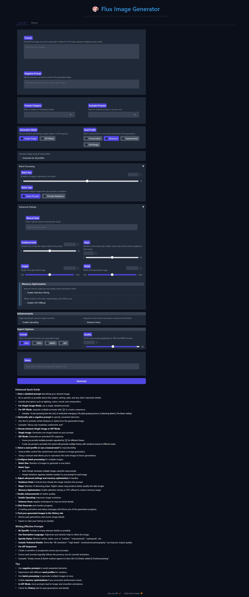
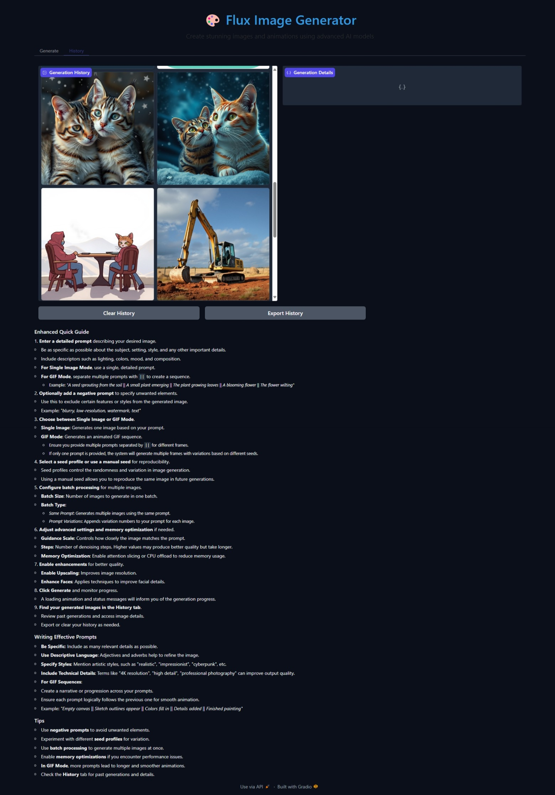

# FluxPipeline

FluxPipeline is a prototype experimental project that provides a framework for working with the **FLUX.1-schnell** image generation model. This project is intended for educational and experimental purposes only.

## Table of Contents

- [FluxPipeline](#fluxpipeline)
  - [Table of Contents](#table-of-contents)
  - [Disclaimer](#disclaimer)
  - [Base Model](#base-model)
  - [Features](#features)
  - [Installation](#installation)
    - [Prerequisites](#prerequisites)
    - [Option 1: Install via Virtual Environment (Recommended)](#option-1-install-via-virtual-environment-recommended)
    - [Option 2: Running Tests](#option-2-running-tests)
    - [Option 3: Install via Docker](#option-3-install-via-docker)
  - [Usage](#usage)
    - [GUI Interface](#gui-interface)
    - [Command Line Interface](#command-line-interface)
  - [Configuration](#configuration)
    - [Environment Variables](#environment-variables)
    - [Memory Settings](#memory-settings)
  - [Hardware Requirements](#hardware-requirements)
    - [Minimum Requirements](#minimum-requirements)
    - [Recommended Specifications](#recommended-specifications)
    - [Supported GPUs](#supported-gpus)
  - [Dependencies](#dependencies)
  - [Troubleshooting](#troubleshooting)
    - [Common Issues](#common-issues)
    - [Frequently Asked Questions](#frequently-asked-questions)
  - [Contributing](#contributing)
    - [Development Guidelines](#development-guidelines)
      - [Code Style](#code-style)
      - [Testing](#testing)
      - [Documentation](#documentation)
  - [License](#license)
    - [Code](#code)
    - [Model](#model)
  - [Acknowledgments](#acknowledgments)
  - [Contact](#contact)
  - [Project Status](#project-status)
  - [Next Steps](#next-steps)

---

## Disclaimer

This is a prototype project created for learning and experimentation. It is **not intended for production use**. The creator(s) of this project are **not responsible** for any misuse or consequences of using this software. Users should comply with all applicable laws and the base model's usage restrictions.

**Important:** *Both the FLUX.1-schnell model and this code are **not available for commercial use**. Any commercial use is strictly prohibited.*

**Note:** *Only the Docker CPU and CUDA versions have been tested. Other configurations may not work as expected and are not guaranteed.*

## Base Model

This project uses the **FLUX.1-schnell** model created by Black Forest Labs.

- **Description:** A 12-billion-parameter rectified flow transformer.
- **Capabilities:** Generates high-quality images in 1-4 steps.
- **License:** Released under the Apache-2.0 license with additional restrictions on commercial use.
- **More Information:** [FLUX.1-schnell on Hugging Face](https://huggingface.co/black-forest-labs/FLUX.1-schnell)

**Note:** *Users must comply with the FLUX.1-schnell model's license and usage restrictions, including the prohibition of commercial use.*

## Features

- **Advanced Image Generation**
  - Single image generation
  - GIF sequence generation
  - Batch processing
  - Seed management for reproducibility

- **Multi-GPU Support**
  - NVIDIA CUDA support
  - AMD ROCm support
  - Intel OneAPI support
  - Automatic vendor detection

- **Memory Management**
  - Dynamic memory optimization
  - Multi-vendor GPU support
  - Memory pressure monitoring
  - Automatic cleanup

- **User Interfaces**
  - Web-based GUI (Gradio)
  - Command-line interface
  - Real-time progress tracking
  - Generation history

## Installation

FluxPipeline can be installed using a virtual environment (recommended) or via Docker. Choose the method that best suits your environment and preferences.

### Prerequisites

Before proceeding, ensure you have the following installed:

- **Git:** [Download and install Git](https://git-scm.com/downloads)
- **Python 3.8 or higher:** [Download and install Python](https://www.python.org/downloads/)
- **Anaconda (Recommended):** [Download and install Anaconda](https://www.anaconda.com/products/distribution)
- **Docker:** [Download and install Docker](https://docs.docker.com/get-docker/) (if using Docker installation)

### Option 1: Install via Virtual Environment (Recommended)

We recommend using Anaconda to manage your Python environments. Detailed instructions are provided in [conda_setup.md](conda_setup.md).

1. **Clone the Repository**

   ```bash
   git clone https://github.com/Xza85hrf/flux_pipeline.git
   cd flux_pipeline
   ```

2. **Create a Conda Environment**

   Create and activate a conda environment to isolate project dependencies.

   ```bash
   conda create -n flux python=3.11 -y
   conda activate flux
   ```

   *Explanation:* This creates a new environment named `flux` with Python 3.11.

3. **Install Dependencies**

   Choose the requirements file that matches your hardware:

   - **CPU-only Installation:**

     ```bash
     pip install -r requirements.txt
     ```

   - **NVIDIA GPUs (CUDA support):**

     ```bash
     pip install -r requirements_cuda.txt
     ```

   - **AMD GPUs (ROCm support):**

     ```bash
     pip install -r requirements_rocm.txt
     ```

   - **Intel GPUs (OneAPI support):**

     ```bash
     pip install -r requirements_intel.txt
     ```

   **Note:** Ensure that you have the appropriate GPU drivers and software installed. For example, for CUDA support, install the [NVIDIA CUDA Toolkit](https://developer.nvidia.com/cuda-downloads).

4. **Running Tests**

   It's a good practice to run tests to ensure everything is set up correctly.

   ```bash
   # Run all tests with verbose output
   python -m pytest tests -v

   # Run tests for a specific module
   python -m pytest tests/unit/utils/test_system_utils.py -v

   # Run tests using pytest directly
   pytest
   ```

   *Example Output:*

   ```bash
   ================== test session starts ==================
   collected 10 items

   tests/unit/test_example.py::test_function PASSED     [ 10%]
   ...
   ================== 10 passed in 2.34s ==================
   ```

   **Note:** If you encounter any issues, refer to the [Troubleshooting](#troubleshooting) section.

### Option 2: Running Tests

If you have already installed the project using the virtual environment, you can run tests as follows:

```bash
# Activate your environment if not already active
conda activate flux

# Run tests
pytest
```

### Option 3: Install via Docker

Docker simplifies the setup process by packaging the application and its dependencies into a container.

1. **Install Docker**

   If you haven't already, install Docker:

   - **Windows and Mac:** [Docker Desktop](https://www.docker.com/products/docker-desktop)
   - **Linux:** [Docker Engine](https://docs.docker.com/engine/install/)

2. **Clone the Repository**

   ```bash
   git clone https://github.com/Xza85hrf/flux_pipeline.git
   cd flux_pipeline
   ```

3. **Build the Docker Image**

   Build the Docker image using the provided `Dockerfile`. This may take several minutes.

   - **For CPU-only:**

     ```bash
     docker build -f Dockerfile.cpu -t flux_pipeline_cpu .
     ```

   - **For NVIDIA GPUs (CUDA support):**

     ```bash
     docker build -f Dockerfile.cuda -t flux_pipeline_cuda .
     ```

   **Note:** Only the CPU and CUDA versions have been tested. Other configurations may not work as expected.

4. **Run the Docker Container**

   - **For CPU-only:**

     ```bash
     docker run -p 7860:7860 flux_pipeline_cpu
     ```

   - **For NVIDIA GPUs:**

     Ensure you have the [NVIDIA Container Toolkit](https://docs.nvidia.com/datacenter/cloud-native/container-toolkit/install-guide.html#docker) installed.

     ```bash
     docker run --gpus all -p 7860:7860 flux_pipeline_cuda
     ```

   **Explanation:**

   - `-p 7860:7860`: Maps port 7860 inside the container to port 7860 on your local machine.
   - `--gpus all`: Grants the container access to all GPUs (for CUDA version).

5. **Access the Interface**

   - Open your browser at `http://localhost:7860`.

**Dockerfile Note:** The `Dockerfile.cpu` and `Dockerfile.cuda` are included in the repository and are configured to automatically start the GUI upon container startup.

## Usage

### GUI Interface

1. **Start the GUI**

   If you installed via virtual environment:

   ```bash
   python gui.py --share
   ```

   *Explanation:* The `--share` flag allows you to create a public URL to share your interface.

   If you installed via Docker, the GUI starts automatically when you run the container.

2. **Access the Interface**

   - Open your browser at `http://localhost:7860`.
   - Enter generation parameters such as prompt, negative prompt, steps, and guidance scale.
   - Click "Generate" to create images.

   **Screenshots:**

   
   *Main screen of the Gradio interface.*

   
   *Generation history and settings.*

### Command Line Interface

1. **Basic Generation**

   ```bash
   python main.py --prompt "Your prompt here"
   ```

   *Example:*

   ```bash
   python main.py --prompt "A futuristic cityscape at sunset"
   ```

2. **Advanced Options**

   ```bash
   python main.py \
     --prompt "Your prompt" \
     --negative_prompt "Things to avoid" \
     --seed 42 \
     --steps 4 \
     --guidance_scale 0.0
   ```

   *Example:*

   ```bash
   python main.py \
     --prompt "A serene mountain landscape" \
     --negative_prompt "No people, no animals" \
     --seed 123 \
     --steps 5 \
     --guidance_scale 7.5
   ```

## Configuration

### Environment Variables

- `CUDA_VISIBLE_DEVICES`: Control GPU visibility.
- `PYTORCH_CUDA_ALLOC_CONF`: Memory allocation settings.
- `KMP_DUPLICATE_LIB_OK`: Intel library configuration.
- `TRANSFORMERS_OFFLINE`: Offline mode setting.

*Example:*

```bash
export CUDA_VISIBLE_DEVICES=0
export PYTORCH_CUDA_ALLOC_CONF=max_split_size_mb:512
```

### Memory Settings

Configure memory management in `config/env_config.py`:

```python
DEFAULT_MODEL_CONFIG = {
    "memory_threshold": 0.90,
    "max_retries": 3,
    "enable_xformers": False,
}
```

*Explanation:* Adjust `memory_threshold` to control when to offload models to CPU.

## Hardware Requirements

### Minimum Requirements

- **CPU:** 4 cores
- **RAM:** 8 GB
- **Storage:** 10 GB
- **GPU:** 4 GB VRAM (optional)

### Recommended Specifications

- **CPU:** 8+ cores
- **RAM:** 16 GB+
- **Storage:** 20 GB+ SSD
- **GPU:** 8 GB+ VRAM

**Note:** Before installing, check your hardware's compatibility with the required software. Ensure your GPU supports the necessary frameworks (CUDA for NVIDIA, ROCm for AMD, OneAPI for Intel).

### Supported GPUs

- **NVIDIA:** CUDA 11.0+
- **AMD:** ROCm 4.0+
- **Intel:** OneAPI 2021.1+

## Dependencies

The dependencies for FluxPipeline are specified in the following requirements files:

- `requirements.txt`: Basic installation for CPU-only environments.
- `requirements_cuda.txt`: For systems with NVIDIA GPUs and CUDA support.
- `requirements_rocm.txt`: For systems with AMD GPUs and ROCm support.
- `requirements_intel.txt`: For systems with Intel GPUs and OneAPI support.

**Note:** Each requirements file includes the core dependencies along with hardware-specific packages.

## Troubleshooting

### Common Issues

1. **Out of Memory Errors**

   - **Solutions:**
     - Enable attention slicing.
     - Reduce batch size.
     - Enable CPU offloading.
     - Clear CUDA cache.

   *Example:*

   ```bash
   export PYTORCH_CUDA_ALLOC_CONF=max_split_size_mb:128
   ```

2. **CUDA Errors**

   - **Solutions:**
     - Update GPU drivers.
     - Check CUDA compatibility.
     - Verify PyTorch installation.
     - Clear GPU memory.

   *Example:*

   ```bash
   nvidia-smi --gpu-reset
   ```

3. **Generation Failures**

   - **Solutions:**
     - Check prompt length.
     - Verify model loading.
     - Monitor memory usage.
     - Check error logs.

### Frequently Asked Questions

1. **I get a `ModuleNotFoundError` when running the code.**

   - **Solution:** Ensure you've installed all dependencies using the appropriate `requirements` file.

2. **The GUI does not load or shows errors.**

   - **Solution:** Check if all required ports are open and not blocked by a firewall. Ensure the Gradio package is properly installed.

3. **GPU is not being utilized during processing.**

   - **Solution:** Verify that your GPU drivers are correctly installed. Ensure you've installed the GPU-specific requirements file.

4. **Docker container fails to start or crashes immediately.**

   - **Solution:** Check the Docker logs for error messages. Ensure that your system meets the hardware requirements and that Docker has the necessary permissions.

## Contributing

**Important:** *This project is intended for personal, educational, and experimental purposes only. Contributions are welcome for improving the project in these contexts. Commercial use of the code is prohibited.*

1. **Fork the Repository**

   ```bash
   git clone https://github.com/Xza85hrf/flux_pipeline.git
   ```

2. **Create a Feature Branch**

   ```bash
   git checkout -b feature/your-feature
   ```

3. **Make Changes**

   - Follow code style guidelines.
   - Add tests for new features.
   - Update documentation accordingly.

4. **Submit a Pull Request**

   - Provide a clear description of changes.
   - Reference any related issues.
   - Update the changelog if necessary.

### Development Guidelines

#### Code Style

- Follow PEP 8 standards.
- Use type hints where appropriate.
- Add docstrings to functions and classes.
- Comment complex logic for clarity.

#### Testing

- Write unit tests for new code.
- Add integration tests where applicable.
- Test error handling paths.
- Verify memory management effectiveness.

#### Documentation

- Update the README and other docs.
- Ensure docstrings are up to date.
- Include examples and usage instructions.
- Document any configuration changes.

## License

[![CC BY-NC 4.0][cc-by-nc-shield]][cc-by-nc]

FluxPipeline © 2024 by [Xza85hrf](https://github.com/Xza85hrf) is licensed under the [Creative Commons Attribution-NonCommercial 4.0 International License][cc-by-nc].

[cc-by-nc]: https://creativecommons.org/licenses/by-nc/4.0/
[cc-by-nc-shield]: https://img.shields.io/badge/License-CC%20BY--NC%204.0-lightgrey.svg

### Code

This project's code is licensed under the **Creative Commons Attribution-NonCommercial 4.0 International (CC BY-NC 4.0)** license. This means:

- **Attribution:** You must give appropriate credit, provide a link to the license, and indicate if changes were made.
- **Non-Commercial:** You may not use the material for commercial purposes.

**Full License Text:** See the [LICENSE](LICENSE) file for details.

### Model

The **FLUX.1-schnell** model used by this project is licensed separately by Black Forest Labs. It is subject to its own licensing terms and restrictions, including limitations on commercial use.

**Important:** Users must comply with the FLUX.1-schnell model's license when using this project. Please review the model's [license and usage restrictions](https://huggingface.co/black-forest-labs/FLUX.1-schnell) before use.

---

*This project does not include the FLUX.1-schnell model files. Instructions are provided for users to download the model from its official source.*

## Acknowledgments

- Thanks to the [PyTorch](https://pytorch.org/) team.
- Thanks to the [Hugging Face](https://huggingface.co/) team.
- Thanks to the [Gradio](https://gradio.app/) team.
- Thanks to all [contributors](https://github.com/Xza85hrf/flux_pipeline/graphs/contributors).

## Contact

- **GitHub Issues:** [Project Issues](https://github.com/Xza85hrf/flux_pipeline/issues)

## Project Status

- Actively developing core components, test coverage, and documentation.
- Focusing on enhancing user experience and stability.

## Next Steps

- **Improve Test Coverage:** Targeting 100% coverage for critical modules.
- **Feature Enhancements:** Implementing new generation modes and style transfer.
- **User Interface:** Enhancing the GUI based on user feedback.
